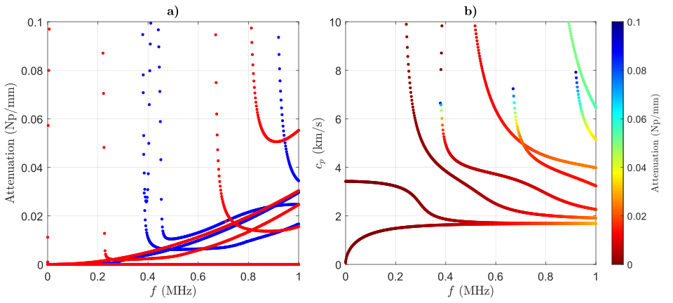

# BoneDC

**BoneDC** is a MATLAB implementation for computing guided wave dispersion curves in stratified biological media using the **Spectral Collocation Method (SCM)**. It supports multilayer solid-fluid models—including cortical bone (CB), soft tissue (ST), and marrow (MR)—and is designed for fast and accurate modeling of anisotropic and viscoelastic waveguides. This tool is intended for applications in **Quantitative Ultrasound (QUS)** for bone health assessment and can also be adapted for use in **Nondestructive Evaluation (NDE)** of layered materials.

A detailed explanation of this implementation is provided in *Ref. [1]*.

## Acknowledgment:
This code was inspired by [@GEW_dispersion_script](https://github.com/dakiefer/GEW_dispersion_script) by Daniel Kiefer. In particular, the implementation of the tensor-based matrices and the boundary conditions for a single cortical bone layer (see lines 20–30 in f_matrix_generation.m) builds upon the structure and ideas from his original work. Please refer to his repository for further details and insights.

## Key Features

- **Multi-layer, Viscoelastic and Anisotropic Support**: Handles 1-, 2-, and 3-layer solid–fluid configurations (e.g., CB, ST+CB, ST+CB+MR)
- **High Performance**: Accurate and fast with parallel computing (< 0.5s for a 3D calculation of the 3-layer case on 12th Gen Intel® Core™ i7-12700 @ 2.10 GHz)
- **3D Dispersion Curves**: Generates 3D visualizations of guided wave dispersion
- **Mode Classification**: For both 3D and 2D curves
- **Extensible Design**: Ready for integration with inverse solvers or further development
- **Publication-Ready Plots**: Produces high-quality figures suitable for academic publishing


  
<div align="center">
<em>Figure 1. Three-dimensional dispersion curves (a) of waves in an <strong>elastic</strong> cortical bone plate and
their two-dimensional views (b, c, d). Non-attenuated propagating waves, attenuated waves and
evanescent waves are in blue, green, and red, respectively.</em>
</div>

  
<div align="center">
<em>Figure 2. Two-dimensional dispersion curves of waves in an <strong>elastic</strong> cortical bone plate. Symmetric modes in blue and Antisymmetric modes in red.</em>
</div>

  
<div align="center">
<em>Figure 3. Three-dimensional dispersion curves (a) of waves in a <strong>viscoelastic</strong> cortical bone plate and
their two-dimensional views (b, c, d). Low-attenuation waves in blue (symmetric) and red (antisymmetric), high-
attenuation waves in green (symmetric) and yellow (antisymmetric).</em>
</div>

  
<div align="center">
<em>Figure 4. Two-dimensional dispersion curves of waves in a <strong>viscoelastic</strong> cortical bone plate. a) Attenuation vs Frequency (symmetric modes in blue and Antisymmetric modes in red); b) Phase velocity superimposed by attenuation spectra.</em>
</div>

## Requirements

- MATLAB (R2021b or newer recommended)  
- Parallel Computing Toolbox  
- `chebdif` function (or an equivalent Chebyshev differentiation function) – [@DMSUITE](https://www.mathworks.com/matlabcentral/fileexchange/29-dmsuite) by J.A.C Weideman

ℹ️ *The `chebdif.m` function is included with permission from Prof. J.A.C. Weideman. Please cite his original work when using it.*

## Getting Started

1. Clone the repository:  
```bash
git clone https://github.com/ductho-le/BoneDC.git
cd BoneDC
```

2. Open `BoneDC_elas.m` or `BoneDC_visco.m` with MATLAB (if MATLAB is in your system path):
```bash
matlab -r "edit('BoneDC_elas.m')"
matlab -r "edit('BoneDC_visco.m')"
```

3. Edit your model and material

4. Run the script to compute and visualize the dispersion curves.

## References

If you use this code in your work, please cite the following papers:

1. **Le et al. (2025)**, Guided waves in anisotropic and viscoelastic stratified plates: Application to bone quantitative ultrasound, _Computers and Structures_, DOI: [10.1016/j.compstruc.2025.107820](https://doi.org/10.1016/j.compstruc.2025.107820)
2. **Le et al. (2024)**, Robust guided wave inversion for estimating bone thickness and elasticity, _J. Acoust. Soc. Am._, DOI: [10.1121/10.0034604](https://doi.org/10.1121/10.0034604)

### Further reading:

- Trefethen (2000), Spectral Methods in MATLAB, _SIAM_, DOI: [10.1137/1.9780898719598](https://doi.org/10.1137/1.9780898719598)  
- Adamou et al. (2004), Spectral methods for modelling guided waves in elastic media, _J. Acoust. Soc. Am._, DOI: [10.1121/1.1777871](https://doi.org/10.1121/1.1777871)

### Check out these repos for other dispersion calculations:
- [@Dispersion-Calculator](https://github.com/ArminHuber/Dispersion-Calculator) by Armin Huber  
- [@Lamb-Wave-Dispersion](https://github.com/franciscorotea/Lamb-Wave-Dispersion) by Francisco Rotea  
- [@GEW_dispersion_script](https://github.com/dakiefer/GEW_dispersion_script) by Daniel Kiefer  
- [@PyDispersion](https://github.com/luan-th-nguyen/PyDispersion) by Luan Nguyen  
- [@waveguicsx](https://github.com/Universite-Gustave-Eiffel/waveguicsx) by Université Gustave Eiffel  
- [@The-Dispersion-Box](https://github.com/adilorta/The-Dispersion-Box) by Adil Han Orta  
- [@SAMWISE](https://github.com/haukegravenkamp/SAMWISE) by Hauke Gravenkamp  
- [@pydisperse](https://github.com/nmbader/pydisperse) by Milad Bader

## License

This project is licensed under the MIT License – see the LICENSE file for details.
